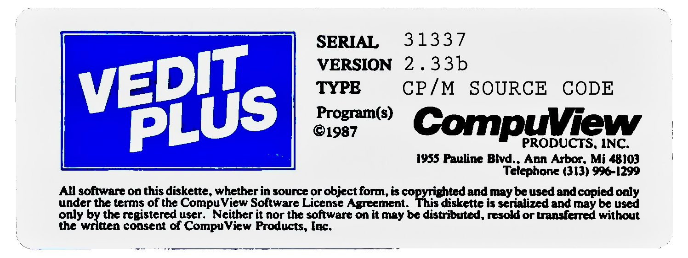

# VEDIT ⧸ VEDIT‑PLUS for CP/M



```
COMMAND: EV
VEDIT PLUS Ver. 2.33b 04/27/87
```

## Table of Contents

<!-- toc -->

- [Overview](#overview)
- [Introduction](#introduction)
- [Building](#building)
  - [Cross-development](#cross-development)
  - [Build Example](#build-example)
  - [Configuration Example](#configuration-example)
- [Extras](#extras)
- [Future](#future)
- [License](#license)
- [Documentation](#documentation)
- [Links](#links)

<!-- tocstop -->

## Overview

This is the source code for **VEDIT** ⧸ **VEDIT‑PLUS** for CP/M,
version 2.33b (04/27/87), the commercial text editing system and
(TECO-derived) text-oriented programming language, produced by
Theodore Green and Greenview Data Inc. (formerly CompuView Products,
Inc.) of Ann Arbor, Michigan.

This incarnation of VEDIT was created in 1979 and was commercially
supported until 1988 (when it was superseded by VEDIT 3) and is the
direct predecessor of the current [VEDIT](https://www.vedit.com/)
product available from VEDIT, Inc.

This VEDIT ⧸ VEDIT‑PLUS source code can be assembled to produce
binaries compatible with various processors (8080, Z80, etc.) and
operating systems (CP/M, MP/M, CDOS, etc.).

Historically, compatible VEDIT ⧸ VEDIT‑PLUS versions were adapted
for CP/M‑80, MP/M‑80, CDOS, CP/M‑86, MP/M‑86, Concurrent CP/M‑86,
SCP 86‑DOS, MS‑DOS, MSX‑DOS, Cromix, and Turbo DOS.

Later versions were available for PC‑MOS/386, CP/M‑68K, IBM
4960/FlexOS, IBM OS/2, UNIX/Xenix, QNX, and Microsoft Windows (both
16-bit Windows 3.1 and 32-bit Windows 95/NT).

Companion programs (*i.e.* V‑PRINT, V‑SPELL, V‑COM, Z80‑8086
Translator, etc.) were also produced.

## Introduction

(*from the VEDIT User's Manual*)

VEDIT is an editor designed to take full advantage of a CRT display
to make your word processing and program development editing as fast
and easy as possible.  VEDIT's "Visual Mode" offers true
"What-you-see-is-what-you-get" type editing, which continuously
displays a region of your file on the screen and allows any changes
made to the screen display to become the changes in the file.  You
can change the screen display by moving the displayed cursor to any
place in the file and then typing in new text or typing an edit
function key.  These insertions, deletions, and corrections are
immediately seen on the screen and become the changes to the file.

You can also perform the common word processing operations of
wrapping words at the end of lines and formatting paragraphs between
right and left margins.  It is easy to print any portion of the text
being worked on. Horizontal scrolling allows editing of very long
lines.  Ten scratchpad buffers may be used for extensive "cut and
paste" operations.  Powerful search and selective replace operations
simplify editing.  Other features, such as automatic indenting for
structured programming languages, simplify and enhance program
development editing.

VEDIT also provides a very flexible and powerful "Command Mode",
which serves the dual purpose of separating the less commonly used
functions from the "Visual Mode", and of making VEDIT a text oriented
programming language.  Repetitive editing operations can be performed
and blocks of text may be copied or moved within the current file and
other files in an almost unlimited manner.  The extensive file
handling allows multiple files to be edited, split, and merged, other
files to be viewed, and specified portions of other files to be
extracted.  The command macro capability allows complex editing tasks
to be performed automatically.  Examples of such tasks include
numerous search/replace operations on multiple files and source code
translations.  The command macros can be saved on disk for future use.
Online help is available.

You can edit files of virtually any size with little concern over the
actual size of the files.  You can also recover from common disk
write errors, such as running out of disk space, by deleting files or
inserting another disk.

Since so many different hardware configurations, keyboards, editing
applications, and personal preferences exist, VEDIT is supplied with
a customization (installation) program in order to let users create
versions of VEDIT which are most suitable to their hardware,
keyboard, applications, and preferences.

## Building

Currently, the full VEDIT‑PLUS (both Z80 and 8080) CRT
configurations, along with the TRS‑80 Model II variants, have been
built and tested.  The Pπceon V‑100 memory mapped video variant has
not yet been tested.

VEDIT ⧸ VEDIT‑PLUS is built using either the
*Technical Design Labs, Inc.* Z80 Relocating/Linking Disk Assembler
([*TDL ZASM*](doc/TDL_ZASM.pdf)) version 2.21 (1978), or the
*Phoenix Software Associates Ltd.* Macro Assembler
([*PSA PASM*](doc/PSA_PASM.pdf)) version 1.0 (1980).

The VEDIT ⧸ VEDIT‑PLUS sources are closely integrated with the TDL
ZASM ⧸ PSA PASM conditional build system, and rely heavily on the
features and quirks of these particular assemblers.

TDL ZASM ⧸ PSA PASM only outputs diagnostics to the CP/M `LIST`
device, usually a line printer.  Be sure to have a list device
configured and online if you need to examine the assembler output.

*Be aware that TDL ZASM ⧸ PSA PASM make minimal distinctions
between non-fatal warnings and fatal errors in the build summary.
Some (non-fatal) errors currently occur and are not of major concern.
Determining the actual error severity requires carefully examining
the output sent to the list device.*

The source code was very lightly modified to support building with
these particular assembler versions.  These changes include removing
the `DATE` definition, and a small patch to `VEDITT3` to expose the
`HCRSOF` symbol when targeting the 8080/Z80.

The HEX output produced by these assemblers can be directly converted
to an executable COM file using the `HEXCOM` utility.

For Z80 variants, the final executable can be reduced in size by
about 25% while remaining directly executable using the  `POPCOM`
compressor.

* Working versions of these tools are included in the [`dev`](dev)
  directory of this repository for convenience — they are *not* an
  official part of the VEDIT ⧸ VEDIT‑PLUS source distribution.

### Cross-development

The following cross-development tools are highly recommended:

* **ccom** is a cross-platform CP/M‑80 2.2 emulator *that supports
  redirecting the list device output to a file*, suitable for running
  the `ZASM`, `PASM`, and `HEXCOM` programs on a UNIX-like host.  It
  is available as part of the
  [Portable MINCE](https://github.com/johnsonjh/pmince) repository.

* [**cpm**](https://github.com/jhallen/cpm) is *Joe Allen*'s portable
  CP/M‑80 2.2 emulator.  Although it does not support saving the list
  device output, it's `BDOS` simulation makes it suitable for running
  the `POPCOM` executable compressor.

* [**tnylpo**](https://gitlab.com/gbrein/tnylpo) is yet another
  CP/M‑80 2.2 emulator, written by *Georg Brein*, with excellent
  compatibility and curses-based VT‑52/VT‑100 terminal emulation.

Full system simulators (*e.g.*
[Z80PACK](https://www.icl1900.co.uk/unix4fun/z80pack/),
[Open SIMH](https://opensimh.org/),
[YAZE‑AG](https://www.mathematik.uni-ulm.de/users/ag/yaze-ag/), etc.)
are also available and useful for cross-development.

### Build Example

```
V>PASM VEDPLUS.ASM

PSA Macro Assembler [C12011-0102 ]
C. 1980 by Phoenix Software Associates Ltd.

VEDIT (0) or VEDIT PLUS (1) ?: 1

Full version, Z-80, CRT           (1)
Full version, Z-80, Memory mapped (2)
Full version, 8080, CRT           (3)   note:Versions 1-8 have I/O polling
Full version, 8080, Memory mapped (4)        set on and org. @ 0000H. CRT
Mini version, Z-80, CRT           (5)        versions are 24X80 while MEM
Mini version, Z-80, Memory mapped (6)        mapp`d versions are 16X64.
Mini version, 8080, CRT           (7)
Mini version, 8080, Memory mapped (8)        CRT emulation is always ON.
Full version, Z-80, Model II, P&T (9)
Full version, Z-80, Model II, Gen (10)
Full version, Z-80, Piiceon @ 90H (11)
Other version made to custom specs.(12)
       enter a version number (1 to 12) : 3

INCLUDE PRINT FORMATTER? (0=NO) (1=YES): 1

INCLUDE WINDOWS? (0=NO) (1=YES): 1

DEMO VERSION? (0=NO) (1=YES): 0

DEVELOPMENT VERSION?  (0=NO) (1=DEVELOPMENT) (2=ALPHA) (3=BETA): 0

PRODUCE LISTING?  (0=NO) (1=YES) (2=CUSTOMER PATCH ONLY): 0

VEDITT3
VEDITIO
VPLUSB1
VEDITF1
VEDITF2
VEDITC1
VPLUSE1
VEDITC2
VEDITC4
VPLUSSR
VEDIT-CP
VPLUS-R1
VEDITV0
VEDITV1
VEDITV2
VEDITW1
VEDITV3
VEDITV4
VEDITG2
VEDIT
VEDITT3
VEDITIO
VPLUSB1
VEDITF1
VEDITF2
VEDITC1
VPLUSE1
VEDITC2
VEDITC4
VPLUSSR
VEDIT-CP
VPLUS-R1
VEDITV0
VEDITV1
VEDITV2
VEDITW1
VEDITV3
VEDITV4
VEDITG2
 Errors Were Detected *****

V>HEXCOM VEDPLUS

HEXCOM  VERS: 3.00

FIRST ADDRESS 0100
LAST  ADDRESS 89CD
BYTES READ    833E
RECORDS WRITTEN 12
```

* With any luck, you will now have a working (but not yet configured)
  `VEDPLUS.COM` executable.

### Configuration Example

In the following example we configure a `VEDIT` executable that will
work on most modern terminal emulators, such as `xterm`.  Many
additional options are available in the various menus.

```
V>INSTALL VEDPLUS.COM VEDIT.COM
INSTALL - Customization for VEDIT
Copyright (c) 1985, 1987 CompuView Products, Inc.
Last Change: Ted Green - April 20, 1987

VEDIT Version Flags:
1H: 8080 MM
2H: 8086 MM
4H: Crt versions
8H: MS-DOS
10H: CP/M-86
20H: IBM
40H: TI PC
80H: TRS 80
100H: Piiceon

      Enter a version number: 4H

VEDIT version: 233

               MAIN MENU FOR VEDIT INSTALLATION

      Keyboard Layout

        1. Display or Print Keyboard Layout
        2. Modify Keyboard Layout
        3. Add Keystroke Macros to Layout

      Operational Settings

        4. Change Print Parameters (PP commands)
        5. Change Edit Parameters (EP commands)
        6. Change Edit Switch Settings (ES commands)
        7. Change Visual Mode Interface
        8. Change Command Mode Interface
        9. Change File Handling Parameters

      Machine Related Settings

       10. Change Screen Display Parameters
       11. Additional Memory Mapped Installation Features
       12. Select CRT Terminal Type

      Enter the option number or "E" to Exit: 12

  Supported Computers and CRT Terminals:

  1. ACT-IV                         17. DYNABYTE 57
  2. ADDS REGENT 20, 25             18. EMULOG 200
  3. ADDS REGENT 30, 35, 40, 60     19. FULCRUM VIO-X2
  4. ADDS REGENT 100                20. HAZELTINE / VOLKER CRAIG ( ~ )
  5. ADDS VIEWPOINT                 21. HAZELTINE / VOLKER CRAIG (ESC)
  6. ADDS VIEWPOINT/3A PLUS         22. HEATH/ZENITH H19, H89
  7. ADM-3A                         23. HP 125, 150
  8. ADM-31                         24. HP 2621 - 2645
  9. AMPEX DIALOGUE 80              25. HDS CONCEPT
 10. ANSI X3.64                     26. IBM DISPLAYWRITER
 11. BEEHIVE                        27. IBM 3101
 12. CONTROL DATA CD-110            28. IBM PC (ANSI)
 13. CONTROL DATA CD-722            29. IBM PC (CONC. CP/M-86)
 14. DATAMEDIA                      30. IBM PC (CP/M-86)
 15. DEC VT-100, VT-180, RAINBOW    31. INFOTON 100
 16. DEC VT-52                      32. INTERTUBE II (UP TO VER. 1.7)
 33. INTERTUBE II (LATER), III      49. TELERAY
 34. ISC 8063 AND OTHERS            50. TELEVIDEO 910
 35. KAYPRO ('83 MODELS)            51. TELEVIDEO 910 (DIM)
 36. KAYPRO ('84 MODELS)            52. TELEVIDEO 910+, 925, 950
 37. KIMTRON ABM 85                 53. TELEVIDEO 910+, 925, 950 (DIM)
 38. LINWOOD BETA BANDIT            54. TELEVIDEO 912, 920
 39. MORROW MDT 60                  55. TELEVIDEO 912, 920 (DIM)
 40. NEC APC                        56. TELEVIDEO 914, 924 (REVERSE)
 41. NORTH STAR ADVANTAGE           57. TI PROFESSIONAL (ANSI)
 42. PERKIN ELMER 1251/1245         58. VICTOR 9000
 43. PERKIN ELMER BANTAM 550        59. VOLKER-CRAIG 404
 44. SD VDB 8024                    60. WYSE WY-100
 45. SOROC IQ-120                   61. WYSE WY-50 (132 COLUMN)
 46. SOROC IQ-140                   62. WYSE WY-50 (80 COLUMN)
 47. SUPERBRAIN                     63. XEROX 820
 48. TEC 500                        64. ZENITH Z-100

Type "H" if your terminal is not in the menu

Enter the number of your terminal: 10

[Main Menu] Enter the option number or "E" to Exit: E

Ok to save changes in VEDIT.COM (Y/N)? Y
```

* You will now have a working — and configured — `VEDIT.COM`
  executable.

## Extras

* The files that were shipped on the original CP/M‑80, CP/M‑86,
  and DOS distribution media are included in the [`disk`](disk),
  [`disk/86`](disk/86), and [`disk/dos`](disk/dos) directories,
  respectively.
  * This includes the `INSTALL` (and `INTCOM`) utilities used to
    tailor the executable to your specific system.
[]()

[]()
* Help files are included in the [`hlp`](hlp) directory.  These help
  files should be verified and possibly modified to ensure the key
  bindings (or other source customizations) match what you are
  "shipping to the customer".
[]()

[]()
* The [`zilint`](zilint) directory contains CompuView's Z80‑8086
  Translator macros.
[]()

[]()
* The [`old`](old) directory contains several ancient versions of
  VEDIT (1.31-1.40) released between 1981 and 1985.  These
  distributions may be useful for extraordinarily obscure of extremely
  memory constrained platforms.

## Future

* Building these sources for CP/M‑86 or DOS should be possible:
  * It seems that when building for 8086, the sources would be
    further translated by means of a currently unknown program; many
    such programs were historically commercially available, including
    CompuView's own Translator (which, unfortunately, does *not*
    include the required `MACx` source files as mentioned below).
  * When trying to assemble with `P8086` defined, two missing source
    files, `MAC1.ASM` and `MAC2.ASM`, are referenced.  It is assumed
    that these files would have been part of the currently unknown
    translation package (or cross-assembler software).
  * Further investigation is required.  Once solved, the procedures
    need to be worked out and properly documented.
[]()

[]()
* Find VEDIT-PLUS 2.33b for DOS (or earlier releases) configured for
  IBM PC memory mapped video hardware.
[]()

[]()
* Find the source code for the `INSTALL` and `INTCOM` utilities.
[]()

[]()
* Document `xterm`-compatible terminal settings for enabling arrow
  directional keys, etc.
[]()

[]()
* Add other CompuView products V-PRINT, V-SPELL, V-COM, etc. (sources
  or binaries) to the repository.
[]()

[]()
* Find 
[]()

[]()
Can you help with any of the above?  If you can, please open an
[issue](https://github.com/johnsonjh/VEDIT/issues) and let us know.

## License

* VEDIT ⧸ VEDIT‑PLUS for CP/M is [freely redistributable for
  non-commercial purposes](LICENSE).

## Documentation

* VEDIT Manual (*1987*):
  * [Introduction](doc/introduction.pdf)
  * [Tutorial](doc/tutorial.pdf)
  * [User Guide](doc/user_guide.pdf)
  * [Programming Guide](doc/programming_guide.pdf)
  * [Installation](doc/installation.pdf)
  * [Quick Reference](doc/quick_reference.pdf)
  * [Index](doc/index.pdf)
[]()

[]()
* [VEDIT Manual (*1980*)](doc/vdoc1980.txt)
* [VEDIT Manual (*1981*)](doc/Compuview_VEDIT_1981.pdf)
* [VEDIT Manual (*1983*)](doc/PT_VEDIT_Users_Manual_1983.pdf)
* [VEDIT Manual (*1984*)](doc/VEDIT_Users_Manual_Nov84.pdf)

## Links

* [VEDIT, Inc.](https://www.vedit.com/)
* [VEDIT History](https://web.archive.org/web/20130805180830/http://vedit.com/20Years.htm)
* [Wikipedia: VEDIT](https://en.wikipedia.org/wiki/VEDIT)
